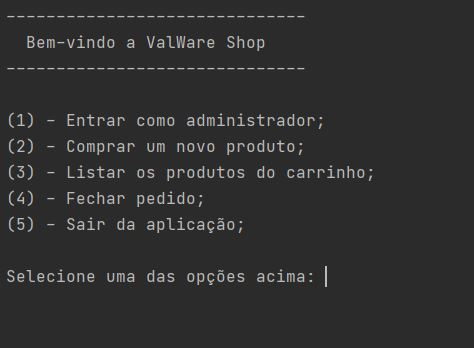
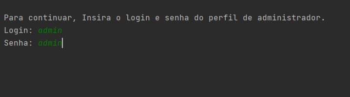
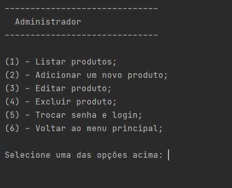
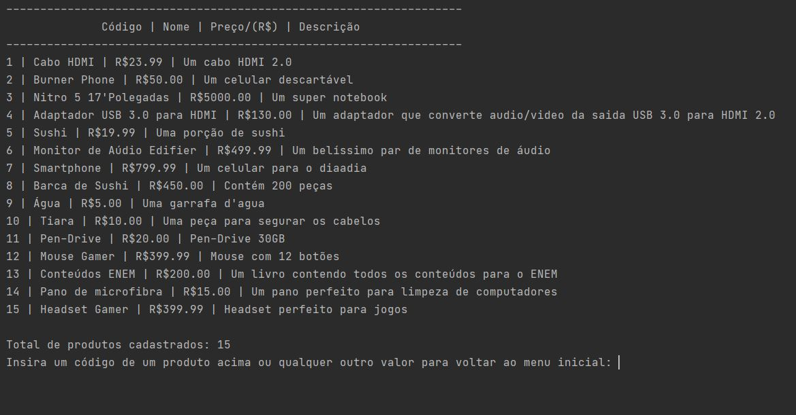
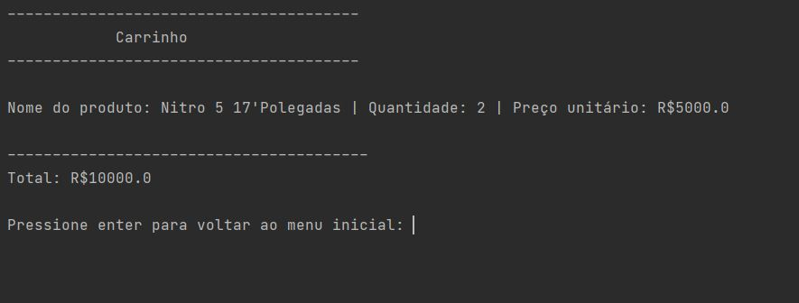
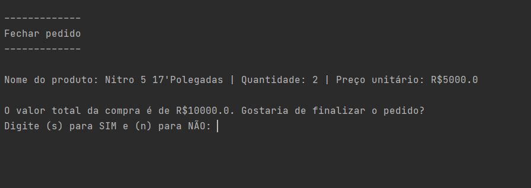
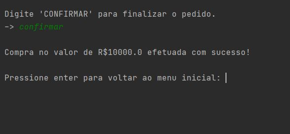

<div align='center'><h1>segundo-projeto-curso-python</h1></div>
<h3>O segundo projeto realizado em um curso de Python na Udemy.</h3>
<hr/>
<br/>
<div align='center'><h2>💻 Sobre o projeto 💻</h2></div>
<br/>
<p>Este projeto foi o segundo projeto realizado no curso de Python ministrado pela Geek University na plataforma digital Udemy. Este programa consiste em criar uma aplicação que simula algumas compras em um mercado. Por ser apenas um mini-projeto, não foi integrado sistemas de pagamentos ou similares. Sistema feito para fins de estudo.</p>
<hr/>
<div align='center'><h2>🤔 Como baixo o repositório? 🤔</h2></div>
<br/>
<p>Para baixar este repositório em sua máquina você precisa ter os seguintes elementos instalados em sua máquina:</p>

- [x] Python na versão 3 ou superior;

- [x] Um editor de código-fonte. Eu utilizo o <a href='https://www.jetbrains.com/pycharm/'>PyCharm</a>, mas fique a vontade para utilizar qualquer outro de sua preferência;
- [x] <a href='https://git-scm.com/download/win'>Git</a>;
<br/>
<p>Agora, insira o seguinte comando no seu terminal Git Bash:</p>

```bash
git clone https://github.com/firminoneto11/segundo-projeto-curso-python.git
```
<br/>
<p>Tudo certo! Agora você tem acesso a este repositório na sua máquina.</p>
<hr/>
<div align='center'><h2>📚 Conteúdo do projeto 📚</h2></div>
<br/>
<p>Agora vamos ver o conteúdo deste projeto. Logo assim que o programa é inicializado, a seguinte tela é apresentada:</p>
<br/>

<br/>
<p>Como pode ser visto, somos apresentados com 5 opções para fazer a utilização do sistema. Selecionando a primeira opção, que irá nos levar ao perfil de administrador. No primeiro acesso, o login e senha são por padrão 'admin' e 'admin':</p>
<br/>

<br/>
<p>Após acessado, outro menu é apresentado, e este por sua vez contém opções diferentes do menu inicial. Neste, podemos listar os produtos que já estão cadastrados, adicionar novos produtos, editar os produtos que já estão cadastrados, excluir um produto cadastrado, trocar o login e senha atuais e voltar ao menu inicial da aplicação:</p>
<br/>

<br/>
<p>Veja alguns produtos que já listei, mas você pode editá-los e até excluí-los:</p>
<br/>

<br/>
<p>Voltando ao menu inicial, após adicionar um dos produtos no carrinho, esta imagem representa como é apresentado o mesmo. Caso seja adicionado mais produtos que tenham o mesmo código, a quantidade no carrinho é aumentada:</p>
<br/>

<br/>
<p>Na parte de fechar o pedido, não foi implementado um sistema de pagamentos, apenas há uma pequena confirmação, solicitando que a palavra 'CONFIRMAR' seja inserida, conforme mostram as imagens abaixo:</p>
<br/>

<br/>

<br/>
<p>E com isso o projeto é finalizado, uma pequena simulação de uma loja ou mercado online. Espero que gostem!</p>
<hr/>
<div align='center'><h2>👾 Autor 👾</h2></div>
<br/>
<p>Feito com ❤ por <a href='https://github.com/firminoneto11'>Firmino Neto</a>.</p>
